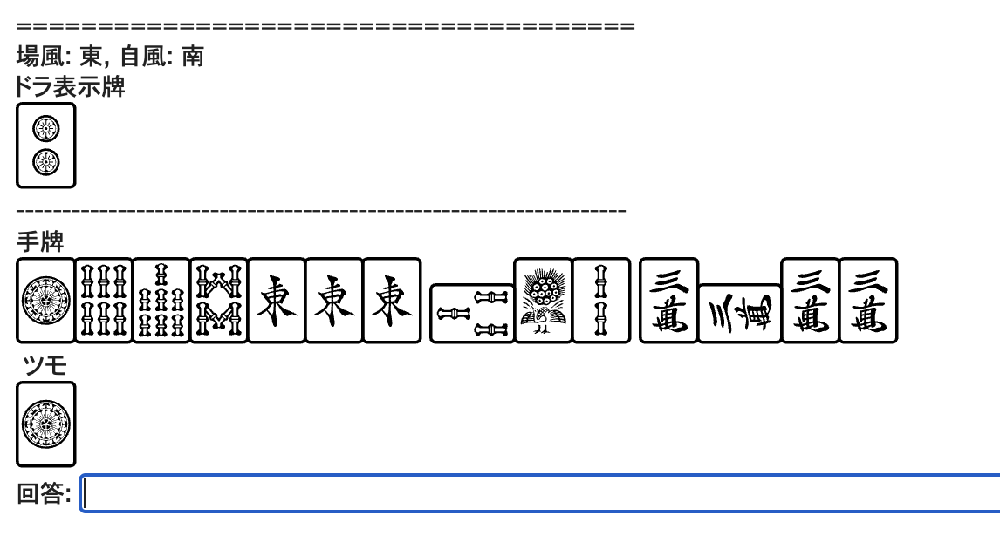

# mahjong question generator

麻雀の点数計算問題を生成します。

```py
from mahjong_question_generator import generate_question

df = generate_question(n=3) # 3問生成
print(df)
```

問題に答えるアプリケーションの例としてnotebook/question.ipynbを公開しています。


